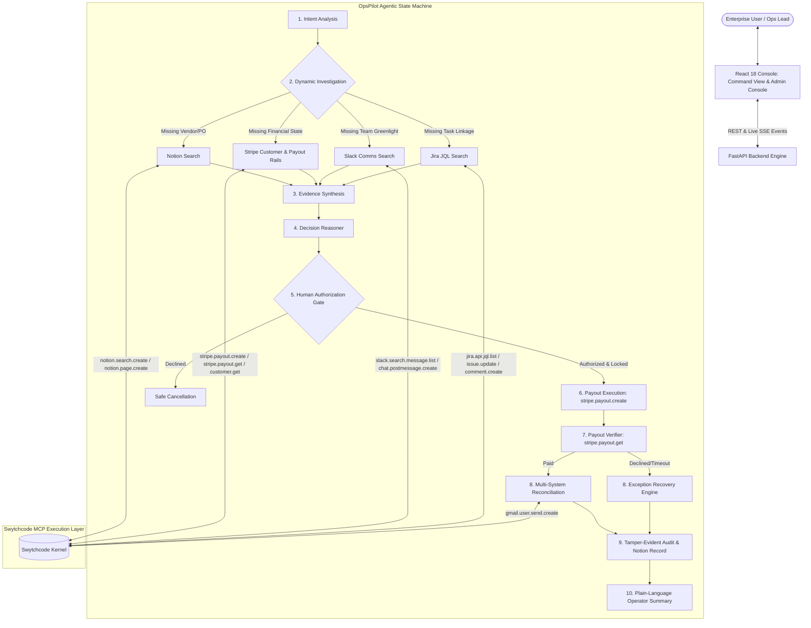

# OpsPilot ⚡

> **"Your AI Operator for Payments, Exceptions & Business Operations."**  
> *Track 6 (AI Business Operator Agent) — Swytchcode Solo Buildathon*

[](https://ops-pilot-livid.vercel.app/)
[](https://ops-pilot-livid.vercel.app/)
[](https://ops-pilot-livid.vercel.app/)

🌐 **Live Production App**: [https://ops-pilot-livid.vercel.app/](https://ops-pilot-livid.vercel.app/)

---

## 🌟 What is OpsPilot?

**OpsPilot** is an autonomous AI Business Operator designed to manage enterprise B2B payment operations from end to end. 

Instead of being a generic chatbot or five disconnected API buttons, OpsPilot functions as a **true agentic system**:
- A human operator gives a high-level operational instruction (e.g. *"Settle Zelar's approved March invoice for ₹2,40,000."*).
- OpsPilot dynamically discovers business context from **Notion**, inspects recipient bank account destinations and prior history in **Stripe**, scans internal team communications in **Slack**, and links operational tracking tasks in **Jira**.
- It enforces a **hard human authorization boundary** with cryptographically locked settlement payloads before any funds move.
- After approval, it executes outbound vendor payouts via `stripe.payout.create`, handles operational exceptions (declines, gateway timeouts, amount mismatches) as **first-class workflows**, prevents duplicate transactions, and reconciles state across **Gmail**, **Slack**, **Jira**, and **Notion**.

---

## 🏗️ Architecture & Agentic Workflow

OpsPilot is powered by **LangGraph** on the backend and uses **Swytchcode** as its sole execution kernel for all external third-party provider APIs.



---

## 🔌 5-Provider Swytchcode Integration Mapping

Every tool call strictly follows approved canonical Swytchcode IDs without bypassing the kernel:

| Provider | Exact Canonical ID | Type | Business Operational Role |
| :--- | :--- | :--- | :--- |
| **Notion** | `notion.search.create`<br>`notion.page.create`<br>`notion.page.update` | Read<br>Write<br>Write | Discovers vendor legal profile, PO approval, verified bank destination (`ba_zelar_corp_hdfc_0981`), and approved invoice amount.<br>Archives permanent operational payment knowledge records. |
| **Stripe** | `stripe.payout.create`<br>`stripe.payout.get`<br>`stripe.customer.get`<br>`stripe.customer.list`<br>`stripe.payment_intent.list` | Write<br>Read<br>Read<br>Read<br>Read | Executes outbound vendor payout directly from enterprise funds to verified recipient bank destination.<br>Polls payout lifecycle status and verifies customer profile history. |
| **Jira** | `jira.api.jql.list`<br>`jira.api.issue.update`<br>`jira.api.issue.create`<br>`jira.api.comment.create` | Read<br>Write<br>Write<br>Write | Searches issues using enhanced JQL, prevents duplicate issue creation by updating existing ticket `SCRUM-42`, and logs exception comments. |
| **Slack** | `slack.search.message.list`<br>`slack.chat.postmessage.create` | Read<br>Write | Scans internal `#finance-ops` for director approval chatter and active payment holds.<br>Posts concise settlement and exception alerts. |
| **Gmail** | `gmail.user.drafts.create`<br>`gmail.user.send.create` | Write<br>Write | Generates plain-language remittance advice email drafts and transmits formal settlement notices to vendor billing contacts. |

---

## 🛡️ Strict 9-Stage Vendor Settlement Lifecycle

```
REQUESTED 
  → CONTEXT_VERIFIED 
  → APPROVAL_REQUIRED 
  → HUMAN_APPROVED 
  → EXECUTION_LOCKED 
  → PAYOUT_CREATING 
  → PAYOUT_CREATED 
  → RECONCILING 
  → PAID / FAILED / UNKNOWN
```

1. **Distinguishing FAILED from UNKNOWN**:
   - A gateway timeout or network failure does **NOT** equal a definite payment failure.
   - OpsPilot marks the state as `UNKNOWN`, avoids duplicate payouts, initiates an automated query on Stripe rails (`stripe.payout.get`), and reconciles state safely.
2. **Duplicate Payment Prevention & Idempotency**:
   - Prior to payout execution, an idempotency lock (`ExecutionLockRegistry`) validates operation IDs. If a matching transaction exists, duplicate execution is strictly blocked.
3. **Amount Mismatch Discrepancy Gate**:
   - If user requests payment for ₹2,80,000 but approved Notion PO record states ₹2,40,000, OpsPilot halts the transaction, blocks the authorization gate, creates a Jira reconciliation ticket, and alerts Finance in Slack.
4. **Jira Duplicate Ticket Prevention**:
   - Before creating new tasks, OpsPilot uses `jira.api.jql.list` to discover existing task `SCRUM-42` and updates it rather than spamming the project.
5. **Separation of Financial & Communication State**:
   - If payout succeeds on Stripe but Gmail communication encounters a glitch, OpsPilot reports *"Payment succeeded, communication retrying"* rather than falsely claiming the payment failed.

---

## 🎯 Pre-Configured Demo Scenarios

| Scenario | Title | Description | Expected Agentic Behavior |
| :--- | :--- | :--- | :--- |
| **1** | **Approved Payout (Success)** | Thoughtworks pays vendor Zelar ₹2,40,000 for verified invoice `ZELAR-MAR-2026-104`. | All 5 providers participate: Notion verifies PO, Stripe checks rails, Slack confirms no holds, Jira links `SCRUM-42`, Human authorizes ₹2.4L, Stripe settles via `stripe.payout.create`, Jira updated, Gmail remittance sent, Slack notified, Notion recorded. |
| **2** | **Payout Rails Exception** | Destination bank error / rejected account during payout dispatch. | Diagnoses failure as an operational exception. Escalates to Jira (`SCRUM-42`), alerts `#finance-ops` in Slack, and updates Notion without blind retries. |
| **3** | **Gateway Timeout / Uncertain State** | Gateway drops connection mid-payout. | Identifies `UNKNOWN` state, enforces duplicate prevention, queries `stripe.payout.get` for intent status, and safe-reconciles without double charging. |
| **4** | **Invoice Amount Mismatch** | User requests ₹2,80,000 for invoice `ZELAR-MAR-2026-104` (approved for ₹2,40,000). | Detects unauthorized ₹40,000 variance, blocks payout, logs Jira reconciliation ticket (`SCRUM-43`), and alerts Finance. |

---

## 🚀 Getting Started

### Prerequisites
- Python 3.10+ (Python 3.14 recommended)
- Node.js v18+ & npm
- Swytchcode CLI (`npm install -g swytchcode`)

### 1. Clone the Repository
```bash
git clone https://github.com/<your-username>/OpsPilot.git
cd OpsPilot
```

### 2. Backend Setup
```bash
# Create and activate Python virtual environment
python -m venv backend/venv

# Windows
.\backend\venv\Scripts\activate
# Linux / macOS
source backend/venv/bin/activate

# Install dependencies
pip install -r backend/requirements.txt

# Run backend test suite (25 tests)
pytest -v

# Start FastAPI backend server
uvicorn backend.app.main:app --reload --port 8000
```
Backend will be live at `http://127.0.0.1:8000` (Interactive API docs at `http://127.0.0.1:8000/docs`).

### 3. Frontend Setup
```bash
# In a separate terminal
cd frontend

# Install dependencies
npm install

# Start Vite dev server
npm run dev
```
Frontend will be live at `http://localhost:5173`.

---

## 🧪 Automated Test Suite

OpsPilot includes a comprehensive suite of **25 automated tests** verifying LangGraph state transitions, tool adapters, Swytchcode normalization, and all 4 end-to-end scenarios:

```bash
pytest -v
```

```
============================= test session starts =============================
tests/test_api.py::test_health_endpoint PASSED                           [  4%]
tests/test_api.py::test_tools_endpoint PASSED                            [  8%]
tests/test_api.py::test_scenarios_endpoint PASSED                        [ 12%]
tests/test_api.py::test_run_submission_and_approval_gate PASSED          [ 16%]
tests/test_decision_engine.py::test_intent_analysis PASSED               [ 20%]
tests/test_decision_engine.py::test_amount_mismatch_detection PASSED     [ 24%]
tests/test_decision_engine.py::test_exception_recovery_timeout_unknown PASSED [ 28%]
tests/test_payout_settlement.py::test_no_payout_before_human_authorization PASSED [ 32%]
tests/test_payout_settlement.py::test_amount_mismatch_blocks_payout PASSED [ 36%]
tests/test_payout_settlement.py::test_unverified_destination_blocks_payout PASSED [ 40%]
tests/test_payout_settlement.py::test_duplicate_operation_blocks_second_payout PASSED [ 44%]
tests/test_payout_settlement.py::test_demo_mode_never_executes_real_swytchcode PASSED [ 48%]
tests/test_payout_settlement.py::test_real_mode_invokes_stripe_payout_create PASSED [ 52%]
tests/test_payout_settlement.py::test_payout_status_changes_subsequent_workflow PASSED [ 56%]
tests/test_payout_settlement.py::test_unknown_state_triggers_payout_get_rather_than_retry PASSED [ 60%]
tests/test_scenarios.py::test_scenario_1_success_workflow PASSED         [ 64%]
tests/test_scenarios.py::test_scenario_2_failure_workflow PASSED         [ 68%]
tests/test_scenarios.py::test_scenario_3_unknown_timeout_workflow PASSED [ 72%]
tests/test_scenarios.py::test_scenario_4_mismatch_workflow PASSED        [ 76%]
tests/test_state.py::test_initial_state_creation PASSED                  [ 80%]
tests/test_tools.py::test_approved_tools_count PASSED                    [ 84%]
tests/test_tools.py::test_notion_search_tool PASSED                      [ 88%]
tests/test_tools.py::test_stripe_tools PASSED                            [ 92%]
tests/test_jira_duplicate_prevention PASSED                              [ 96%]
tests/test_tools.py::test_slack_and_gmail_tools PASSED                   [100%]

============================= 25 passed in 11.68s =============================
```

---

## 📁 Project Structure

```
OpsPilot/
├── backend/
│   ├── app/
│   │   ├── agent/
│   │   │   ├── engine.py             # Decision, intent & exception reasoning engine
│   │   │   ├── graph.py              # Compiled LangGraph workflow with conditional routing
│   │   │   ├── nodes.py              # LangGraph node implementations
│   │   │   ├── scenarios.py          # Scenario definitions & realistic mock data
│   │   │   └── state.py              # OpsPilotState strongly-typed TypedDict
│   │   ├── tools/
│   │   │   ├── swytchcode_client.py  # Swytchcode execution client & mock dispatcher
│   │   │   ├── registry.py           # Catalog of approved Swytchcode tools
│   │   │   ├── notion.py             # Notion adapter (search, create, update)
│   │   │   ├── stripe.py             # Stripe adapter (payout, customer, payments)
│   │   │   ├── jira.py               # Jira adapter (JQL search, create, update, comment)
│   │   │   ├── slack.py              # Slack adapter (messages search, post)
│   │   │   └── gmail.py              # Gmail adapter (draft, send)
│   │   ├── db/
│   │   │   └── database.py           # SQLite persistence & live SSE event dispatcher
│   │   ├── api/
│   │   │   └── routes.py             # FastAPI REST & SSE endpoints
│   │   ├── models/
│   │   │   └── schema.py             # Pydantic schemas (ApprovalLockPayload, AgentEvent, etc.)
│   │   ├── config.py                 # App configuration
│   │   └── main.py                   # FastAPI entrypoint with CORS
│   └── requirements.txt
├── frontend/
│   ├── src/
│   │   ├── components/
│   │   │   ├── Header.jsx            # Top navigation & Swytchcode MCP status
│   │   │   ├── CommandView.jsx       # Primary natural-language business command center
│   │   │   ├── ScenarioBar.jsx       # Interactive scenario buttons & prompt input
│   │   │   ├── WorkflowGraph.jsx     # Visual agentic lifecycle pipeline
│   │   │   ├── ApprovalModal.jsx     # Interactive human authorization gate
│   │   │   ├── ToolTimeline.jsx      # What OpsPilot Handled & Swytchcode details
│   │   │   ├── DecisionLog.jsx       # Live AI reasoning & thought timeline
│   │   │   ├── BusinessDossier.jsx   # Right-panel multi-system context breakdown
│   │   │   ├── AuditTrail.jsx        # Tamper-evident sealed audit vault
│   │   │   └── StateBadge.jsx        # Payment lifecycle state badge
│   │   ├── hooks/
│   │   │   └── useAgentRun.js        # SSE stream listener & run state management
│   │   ├── App.jsx                   # Main application root
│   │   ├── index.css                 # Custom glassmorphic styling
│   │   └── main.jsx                  # React mount
│   ├── package.json
│   ├── vite.config.js
│   └── tailwind.config.js
├── tests/
│   ├── test_api.py
│   ├── test_decision_engine.py
│   ├── test_payout_settlement.py
│   ├── test_scenarios.py
│   ├── test_state.py
│   └── test_tools.py
├── docs/
│   └── ARCHITECTURE.md
├── pytest.ini
├── .env.example
├── .gitignore
└── README.md
```

---

## 🏆 Key Achievements & Hackathon Criteria Highlights

- ✅ **Genuine Agentic Behavior**: Non-linear dynamic investigation loop driven by missing evidence, not a predetermined static script.
- ✅ **All 5 Providers Used Meaningfully**: Notion (PO records), Stripe (payout rails & history), Slack (internal greenlight), Jira (task linkage), Gmail (vendor remittance).
- ✅ **Strict Swytchcode Adherence**: Uses exact Swytchcode canonical IDs (`stripe.payout.create`, `notion.search.create`, `slack.chat.postmessage.create`, etc.) and adheres to schemas without bypassing or fabricating REST calls.
- ✅ **First-Class Exception Handling**: Gracefully handles declines, timeouts, unknown states, and amount discrepancies without crashing.
- ✅ **Hard Human Authorization Gate**: Cryptographically locked payload with verified destination bank account and exact amounts before funds release.
- ✅ **Tamper-Evident Audit & Dual UI**: End-to-end traceability with SQLite event persistence, live SSE streaming, natural-language Command View, and deep Admin Console.
