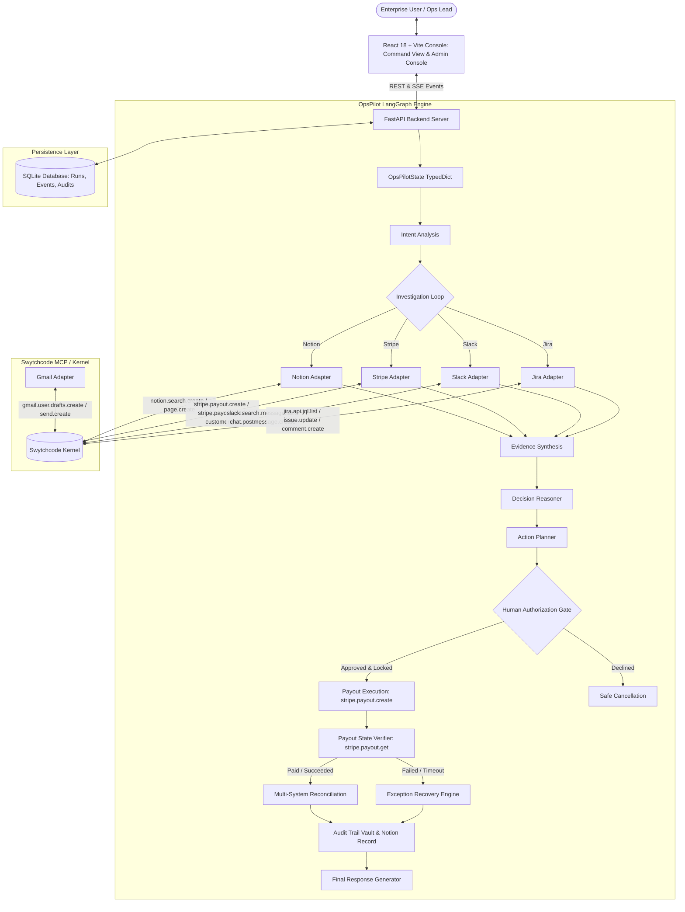
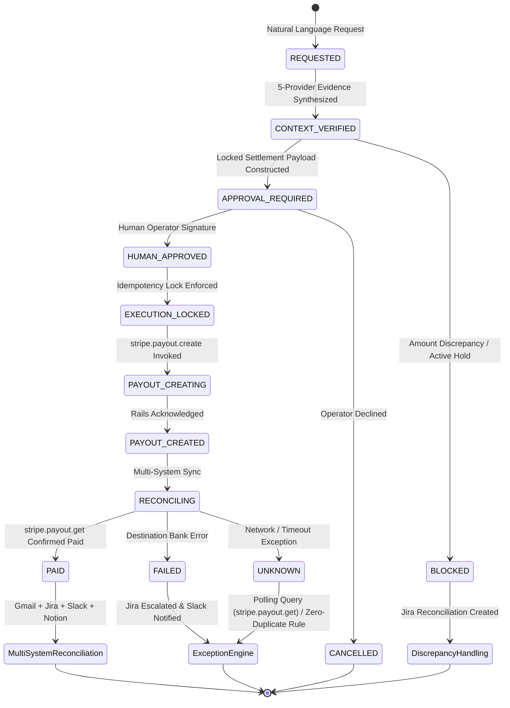

# OpsPilot System Architecture

## Overview
**OpsPilot** is an Autonomous AI Business Operator engineered for enterprise B2B vendor payout operations, exception management, and multi-system reconciliation.

---

## High-Level System Architecture

---

## 5-Provider Swytchcode Integration Mapping

| Provider | Canonical Swytchcode Method | Read / Write | Business Operational Purpose |
| :--- | :--- | :--- | :--- |
| **Notion** | `notion.search.create` `notion.page.create` `notion.page.update` | Read Write Write | Verified vendor legal entity, PO terms (Net-30), verified bank destination, and approved invoice amount. Creates persistent operational knowledge and audit records. |
| **Stripe** | `stripe.payout.create` `stripe.payout.get` `stripe.customer.get` `stripe.customer.list` `stripe.payment_intent.list` | Write Read Read Read Read | Executes outbound vendor payout directly from company balance to verified recipient bank account destination. Polls payout lifecycle status and verifies customer profile history. |
| **Jira** | `jira.api.jql.list` `jira.api.jql.create` `jira.api.issue.create` `jira.api.issue.update` `jira.api.comment.create` | Read Read Write Write Write | Identifies existing payment incident `SCRUM-42` (preventing duplicate ticket creation) and records operational recovery tasks. |
| **Slack** | `slack.search.message.list` `slack.chat.postmessage.create` | Read Write | Searches internal `#finance-ops` channel for director greenlight and active holds. Publishes concise operational settlement updates. |
| **Gmail** | `gmail.user.drafts.create` `gmail.user.send.create` | Write Write | Creates plain-language remittance advice email draft and transmits confirmation to vendor billing contact. |

---

## Strict 9-Stage Vendor Settlement Lifecycle

